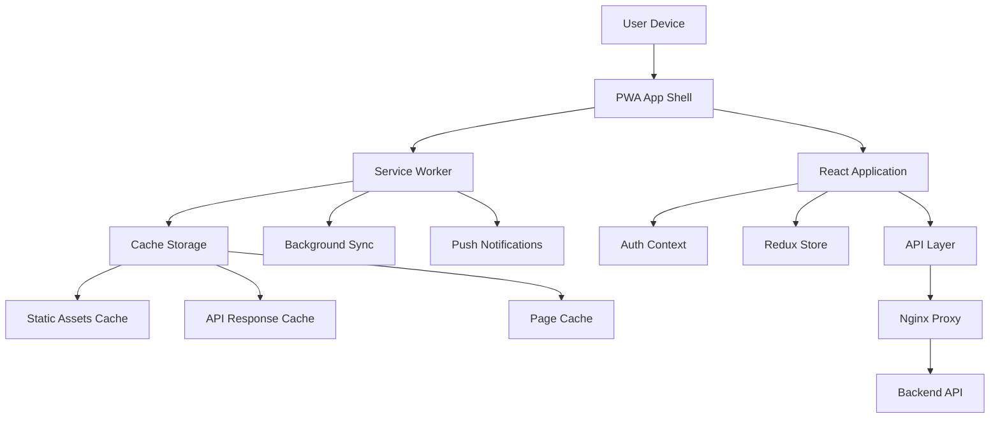

# PWA Conversion Design Document

## Overview

This design outlines the conversion of the existing React application into a Progressive Web App (PWA). The solution leverages Vite's PWA plugin (vite-plugin-pwa) with Workbox for service worker management, implements a comprehensive caching strategy, and ensures seamless integration with the existing nginx configuration.

The PWA will support offline functionality, app installation, push notifications, and optimized performance while maintaining compatibility with the current authentication system and role-based routing.

## Architecture

### High-Level Architecture



### Service Worker Strategy

The PWA will use a **Network First with Cache Fallback** strategy for API calls and a **Cache First with Network Update** strategy for static assets.

## Components and Interfaces

### 1. Web App Manifest Configuration

**Purpose:** Define PWA metadata and appearance settings.

**Manifest Properties:**
```json
{
  "name": "سُبل - نظام إدارة الطلبات والتوزيع",
  "short_name": "سُبل",
  "description": "نظام إدارة الطلبات والتوزيع للإدارة والموزعين",
  "start_url": "/?utm_source=pwa_install",
  "scope": "/",
  "display": "standalone",
  "orientation": "portrait",
  "background_color": "#ffffff",
  "theme_color": "#1976d2",
  "lang": "ar",
  "dir": "rtl",
  "icons": [
    { "src": "/icons/icon-72x72.png", "sizes": "72x72", "type": "image/png" },
    { "src": "/icons/icon-96x96.png", "sizes": "96x96", "type": "image/png" },
    { "src": "/icons/icon-128x128.png", "sizes": "128x128", "type": "image/png" },
    { "src": "/icons/icon-144x144.png", "sizes": "144x144", "type": "image/png" },
    { "src": "/icons/icon-192x192.png", "sizes": "192x192", "type": "image/png" },
    { "src": "/icons/icon-256x256.png", "sizes": "256x256", "type": "image/png" },
    { "src": "/icons/icon-384x384.png", "sizes": "384x384", "type": "image/png" },
    { "src": "/icons/icon-512x512.png", "sizes": "512x512", "type": "image/png", "purpose": "any maskable" }
  ]
}
```

### 2. PWA Configuration (vite-plugin-pwa)

**Purpose:** Configure Vite to generate service worker and manifest files automatically.

**Key Configuration:**
- Workbox service worker generation with versioned caches
- Manifest file generation with proper icons and metadata
- Cache strategies for different resource types
- Background sync for offline actions
- Automatic cache cleanup and size limits

### 3. Service Worker Lifecycle Management

**Purpose:** Handle caching, offline functionality, and background operations with proper lifecycle management.

**Responsibilities:**
- Cache static assets (JS, CSS, images) with versioned cache names
- Cache API responses with appropriate TTL and size limits
- Handle offline scenarios with app shell pattern
- Manage app updates with skipWaiting() and clients.claim()
- Process background sync for offline actions
- Handle push notifications
- Clean up old caches during activation

**Caching Strategies:**
- **Static Assets:** Cache First with versioned cache names (max 50 entries, 30 days TTL)
- **API Calls:** Network First with 5-second timeout, fallback to cache (max 100 entries, 1 day TTL)
- **HTML Pages:** Network First with cache fallback, serve offline.html when unavailable
- **Images:** Cache First with network update (max 200 entries, 7 days TTL)

**Cache Versioning:**
```typescript
const CACHE_VERSION = 'v1.0.0';
const STATIC_CACHE = `static-${CACHE_VERSION}`;
const API_CACHE = `api-${CACHE_VERSION}`;
const PAGES_CACHE = `pages-${CACHE_VERSION}`;
```

**Lifecycle Events:**
- **Install:** Precache app shell and critical resources
- **Activate:** Delete old caches, claim clients immediately
- **Fetch:** Apply caching strategies based on request type

### 4. Background Sync & Offline Data Queue

**Purpose:** Handle offline actions and sync when connectivity is restored.

**Interface:**
```typescript
interface OfflineQueue {
  enqueue(action: OfflineAction): Promise<void>;
  processQueue(): Promise<void>;
  getQueueStatus(): QueueStatus;
  clearQueue(): Promise<void>;
}

interface OfflineAction {
  id: string;
  type: 'CREATE' | 'UPDATE' | 'DELETE';
  endpoint: string;
  data: any;
  timestamp: number;
  retryCount: number;
}
```

**Queue Management:**
- Store failed requests in IndexedDB
- Replay in chronological order when online
- Show pending sync status in UI
- Handle conflicts and duplicate requests

### 5. PWA Manager Service

**Purpose:** Centralized PWA functionality management.

**Interface:**
```typescript
interface PWAManager {
  // Installation
  checkInstallability(): Promise<boolean>;
  promptInstall(): Promise<boolean>;
  
  // Updates
  checkForUpdates(): Promise<boolean>;
  applyUpdate(): Promise<void>;
  
  // Offline status
  isOnline(): boolean;
  onOnlineStatusChange(callback: (online: boolean) => void): void;
  
  // Notifications
  requestNotificationPermission(): Promise<NotificationPermission>;
  showNotification(title: string, options: NotificationOptions): Promise<void>;
  
  // Analytics
  trackInstall(): void;
  trackLaunch(source: 'browser' | 'standalone'): void;
  trackOfflineUsage(): void;
}
```

### 6. Offline Indicator Component

**Purpose:** Display network status to users with accessibility support.

**Interface:**
```typescript
interface OfflineIndicatorProps {
  className?: string;
  showWhenOnline?: boolean;
  ariaLabel?: string;
}
```

### 7. Install Prompt Component

**Purpose:** Handle PWA installation prompts with accessibility.

**Interface:**
```typescript
interface InstallPromptProps {
  onInstall?: () => void;
  onDismiss?: () => void;
  ariaDescribedBy?: string;
}
```

### 8. Update Notification Component

**Purpose:** Notify users about app updates with screen reader support.

**Interface:**
```typescript
interface UpdateNotificationProps {
  onUpdate?: () => void;
  onDismiss?: () => void;
  announceToScreenReader?: boolean;
}
```

### 9. iOS/Safari PWA Support

**Purpose:** Handle Safari-specific PWA requirements.

**Meta Tags Required:**
```html
<meta name="apple-mobile-web-app-capable" content="yes">
<meta name="apple-mobile-web-app-status-bar-style" content="default">
<meta name="apple-mobile-web-app-title" content="سُبل">
<link rel="apple-touch-icon" sizes="180x180" href="/icons/apple-touch-icon.png">
<link rel="apple-touch-startup-image" href="/icons/splash-640x1136.png" media="(device-width: 320px) and (device-height: 568px) and (-webkit-device-pixel-ratio: 2)">
```

### 10. Analytics & Monitoring Integration

**Purpose:** Track PWA usage and performance metrics.

**Interface:**
```typescript
interface PWAAnalytics {
  trackInstall(source: 'browser_prompt' | 'custom_prompt'): void;
  trackLaunch(displayMode: 'browser' | 'standalone' | 'minimal-ui'): void;
  trackOfflineUsage(page: string, duration: number): void;
  trackServiceWorkerError(error: Error, context: string): void;
  trackCacheHitRate(cacheType: string, hitRate: number): void;
}
```

**Monitoring Setup:**
- Google Analytics 4 for user behavior tracking
- Sentry for error monitoring and performance
- Custom metrics for PWA-specific events
- Lighthouse CI for automated audits

## Data Models

### 1. PWA State

```typescript
interface PWAState {
  isInstallable: boolean;
  isInstalled: boolean;
  isOnline: boolean;
  hasUpdate: boolean;
  notificationPermission: NotificationPermission;
  installPromptEvent: BeforeInstallPromptEvent | null;
  offlineQueue: OfflineAction[];
  syncStatus: 'idle' | 'syncing' | 'error';
}
```

### 2. Cache Configuration

```typescript
interface CacheConfig {
  name: string;
  pattern: RegExp;
  strategy: 'CacheFirst' | 'NetworkFirst' | 'StaleWhileRevalidate';
  maxEntries?: number;
  maxAgeSeconds?: number;
  networkTimeoutSeconds?: number;
}
```

### 3. Notification Payload

```typescript
interface NotificationPayload {
  title: string;
  body: string;
  icon?: string;
  badge?: string;
  tag?: string;
  data?: any;
  actions?: NotificationAction[];
  requireInteraction?: boolean;
}
```

### 4. Performance Budget

```typescript
interface PerformanceBudget {
  maxBundleSize: number; // 250KB for main bundle
  maxImageSize: number;  // 100KB per image
  maxCacheSize: number;  // 50MB total cache
  targetLighthouseScores: {
    performance: number; // >= 90
    accessibility: number; // >= 95
    bestPractices: number; // >= 90
    seo: number; // >= 90
    pwa: number; // >= 90
  };
}
```

## Error Handling

### 1. Network Errors
- **Offline Detection:** Monitor navigator.onLine and service worker network events
- **Graceful Degradation:** Show cached content with offline indicators
- **Retry Mechanisms:** Implement exponential backoff for failed requests

### 2. Service Worker Errors
- **Registration Failures:** Fallback to normal operation without PWA features
- **Update Failures:** Retry update process with user notification
- **Cache Errors:** Clear corrupted caches and rebuild

### 3. Installation Errors
- **Unsupported Browsers:** Hide install prompts gracefully
- **Installation Failures:** Provide alternative access methods

## Testing Strategy

### 1. Unit Tests
- PWA Manager service functionality
- Component rendering and interactions
- Cache strategies and offline scenarios

### 2. Integration Tests
- Service worker registration and lifecycle
- Cache population and retrieval
- Offline/online state transitions
- Update mechanisms

### 3. E2E Tests
- Complete PWA installation flow
- Offline functionality across different pages
- Push notification delivery and handling
- App update process

### 4. PWA Audit Tests
- Lighthouse PWA audit compliance
- Performance metrics validation
- Accessibility compliance
- SEO optimization

## Performance Considerations

### 1. Bundle Optimization
- Code splitting for PWA-specific features
- Lazy loading of non-critical PWA components
- Tree shaking of unused Workbox features

### 2. Caching Strategy
- Selective caching based on user roles
- Cache size limits and cleanup policies
- Preloading critical resources

### 3. Service Worker Optimization
- Minimal service worker size
- Efficient cache management
- Background sync batching

## Security Considerations

### 1. Service Worker Security
- Serve service worker from same origin
- Implement proper CSP headers
- Validate cached content integrity
- Use HTTPS for all PWA features

### 2. Notification Security
- Validate notification payloads
- Implement proper permission handling
- Secure notification endpoints
- Sanitize notification content

### 3. Cache Security
- Encrypt sensitive cached data using Web Crypto API
- Implement cache invalidation for auth changes
- Secure offline data storage in IndexedDB
- Clear caches on logout

### 4. Additional Security Headers
```nginx
add_header Strict-Transport-Security "max-age=31536000; includeSubDomains" always;
add_header X-Frame-Options "SAMEORIGIN" always;
add_header X-Content-Type-Options "nosniff" always;
add_header Referrer-Policy "strict-origin-when-cross-origin" always;
add_header Permissions-Policy "geolocation=(), microphone=(), camera=()" always;
```

## Cross-Browser Compatibility & Fallbacks

### 1. Browser Support Matrix
- **Chrome/Edge:** Full PWA support including Background Sync
- **Firefox:** PWA support without Background Sync
- **Safari:** Limited PWA support, requires apple-touch-icon meta tags
- **Mobile browsers:** Varies by platform and version

### 2. Feature Detection & Graceful Degradation
```typescript
interface BrowserCapabilities {
  serviceWorker: boolean;
  pushNotifications: boolean;
  backgroundSync: boolean;
  installPrompt: boolean;
  webAppManifest: boolean;
}

const detectCapabilities = (): BrowserCapabilities => {
  return {
    serviceWorker: 'serviceWorker' in navigator,
    pushNotifications: 'PushManager' in window,
    backgroundSync: 'serviceWorker' in navigator && 'sync' in window.ServiceWorkerRegistration.prototype,
    installPrompt: 'BeforeInstallPromptEvent' in window,
    webAppManifest: 'onappinstalled' in window
  };
};
```

### 3. Polyfills and Fallbacks
- Service Worker polyfill for older browsers
- IndexedDB fallback to localStorage
- Background sync fallback to immediate retry
- Install prompt fallback to manual instructions

## Accessibility (A11y) Compliance

### 1. WCAG 2.1 AA Compliance
- Color contrast ratio ≥ 4.5:1 for normal text
- Color contrast ratio ≥ 3:1 for large text
- Keyboard navigation support for all interactive elements
- Screen reader compatibility with ARIA labels

### 2. PWA-Specific Accessibility
```typescript
// Offline indicator with screen reader support
<div role="status" aria-live="polite" aria-label="اتصال الإنترنت">
  {isOnline ? 'متصل' : 'غير متصل'}
</div>

// Install prompt with proper ARIA attributes
<button 
  aria-describedby="install-description"
  onClick={handleInstall}
>
  تثبيت التطبيق
</button>
<div id="install-description">
  قم بتثبيت التطبيق للوصول السريع من الشاشة الرئيسية
</div>
```

### 3. Focus Management
- Maintain focus order during offline/online transitions
- Announce status changes to screen readers
- Provide keyboard shortcuts for common actions

## Internationalization & Localization

### 1. RTL Support
- Proper RTL layout for Arabic interface
- RTL-aware animations and transitions
- Correct text direction in notifications

### 2. Localized Manifest
```json
{
  "name": "سُبل - نظام إدارة الطلبات والتوزيع",
  "short_name": "سُبل",
  "lang": "ar",
  "dir": "rtl",
  "description": "نظام إدارة الطلبات والتوزيع للإدارة والموزعين"
}
```

### 3. Localized Offline Messages
- Arabic offline indicators and error messages
- Culturally appropriate date/time formatting
- Localized notification content

## CI/CD & Deployment Strategy

### 1. Build Pipeline
```yaml
# GitHub Actions example
- name: Build PWA
  run: npm run build
  
- name: Lighthouse CI
  run: lhci autorun
  
- name: PWA Audit
  run: npm run pwa:audit
  
- name: Bundle Size Check
  run: npm run bundle:analyze
```

### 2. Service Worker Versioning
- Automatic versioning based on build hash
- Staged rollout for service worker updates
- Rollback capability for problematic updates

### 3. Performance Monitoring
- Automated Lighthouse audits on each deployment
- Bundle size regression detection
- Core Web Vitals monitoring

## Privacy Considerations

### 1. Data Collection Notice
- Clear privacy notice for PWA features
- Opt-in consent for notifications
- Transparent cache data handling

### 2. Data Retention Policies
- Automatic cache cleanup after specified periods
- User control over cached data
- Secure deletion of sensitive offline data

## Nginx Integration

### 1. Service Worker Headers
The existing nginx configuration already handles service worker files with no-cache headers:

```nginx
location ~ ^/(sw\.js|workbox-.*\.js|manifest\.json)$ {
    add_header Cache-Control "no-cache, no-store, must-revalidate";
    return 404;
}
```

This will be updated to properly serve the new service worker files.

### 2. Manifest File Serving
Add proper headers for manifest.json:

```nginx
location = /manifest.json {
    proxy_pass http://frontend/manifest.json;
    add_header Cache-Control "public, max-age=86400";
    add_header Content-Type "application/manifest+json";
}
```

### 3. PWA Asset Caching
Static PWA assets will be cached with long-term headers while the service worker handles updates.

## Implementation Phases

### Phase 1: Core PWA Setup
- Install and configure vite-plugin-pwa
- Generate basic manifest and service worker
- Implement basic caching strategies

### Phase 2: Offline Functionality
- Implement offline detection
- Add offline indicators
- Cache critical app routes and API responses

### Phase 3: Installation & Updates
- Add install prompts
- Implement update notifications
- Handle app lifecycle events

### Phase 4: Advanced Features
- Push notifications setup
- Background sync for offline actions
- Performance optimizations

### Phase 5: Testing & Optimization
- Comprehensive testing suite
- Performance audits
- Security reviews